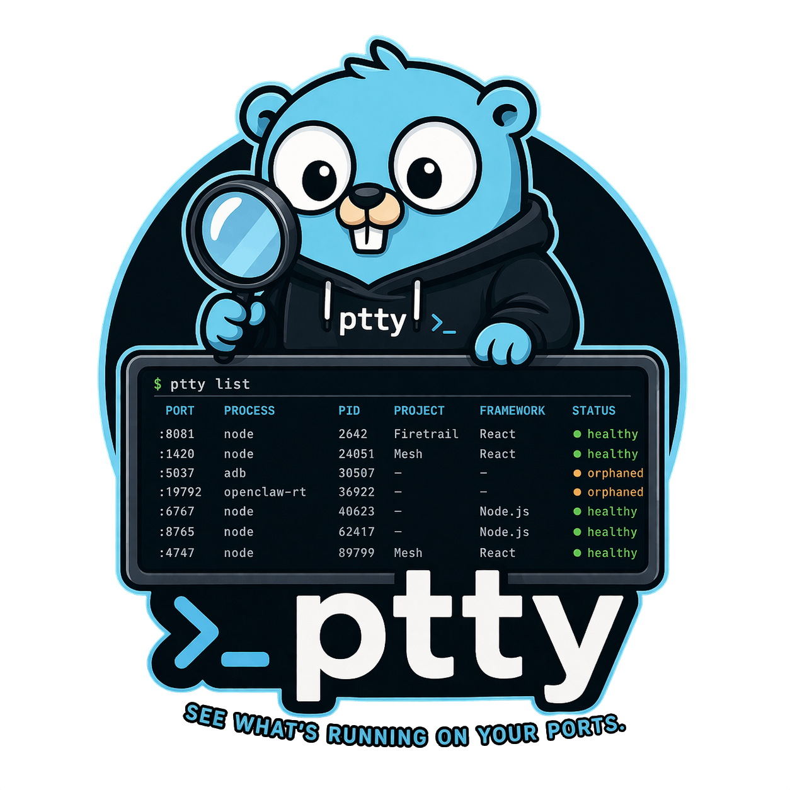

<p align="center">
  
</p>

<h1 align="center">ptty</h1>

<p align="center"><strong>See what's running on your ports.</strong><br>Framework detection, process trees, orphan cleanup — all from your terminal.</p>

```
$ ptty list

PORT    PROCESS                  PID    PROJECT    FRAMEWORK  UPTIME   STATUS
:8081   node                     2642   Firetrail  React      5d 15h   ● healthy
:1420   node                     24051  Mesh       React      15h 21m  ● healthy
:5037   adb                      30507  —          —          4d 13h   ● orphaned
:19792  openclaw-runtime:latest  36922  —          —          3d 22h   ● orphaned
:6767   node                     40623  —          Node.js    9d 22h   ● healthy
:8765   node                     62417  —          Node.js    9d 13h   ● healthy
:50884  node                     82035  —          Node.js    11d 1h   ● orphaned
:4747   node                     89799  Mesh       React      19h 5m   ● healthy
:5199   node                     94070  Mesh       React      9d 12h   ● healthy
```

ptty scans your system for listening TCP ports, identifies what framework each process is running, detects which project it belongs to, and tells you if something has gone rogue.

## Install

**macOS / Linux** (recommended):

```sh
curl -sSL https://raw.githubusercontent.com/iCyberon/ptty/main/install.sh | sh
```

**Windows** (PowerShell):

```powershell
irm https://raw.githubusercontent.com/iCyberon/ptty/main/install.ps1 | iex
```

**Go install**:

```sh
go install github.com/iCyberon/ptty/cmd/ptty@latest
```

**From source**:

```sh
git clone https://github.com/iCyberon/ptty.git
cd ptty
make build
```

### Updating

ptty checks for updates on every launch and shows a notification in the header. Press `U` to update instantly, or run:

```sh
ptty update
```

## Usage

### Interactive TUI

Just run `ptty` — you get a full interactive terminal UI with four tabs:

```
⚡ ptty — 16 listening ports

 Ports [1]    Processes [2]    Watch [3]    Clean [4]
──────────────────────────────────────────────────────
```

| Key | Action |
|-----|--------|
| `1` `2` `3` `4` | Switch tabs |
| `↑` `↓` / `j` `k` | Navigate |
| `Enter` | Port detail view |
| `x` | Kill process |
| `/` | Filter |
| `a` | Toggle all / dev-only |
| `U` | Update to latest version |
| `q` / `Esc` | Quit |

### Port Detail

Drill into any port to see the full picture — memory, CPU, git branch, and the entire process tree:

```
$ ptty detail 8081

Port :8081

  Process    node (PID 2642)
  Status     ● healthy
  Framework  React
  Memory     72.9 MB
  CPU        0.1%
  Uptime     5d 15h
  Directory  /Users/vahagn/Work/firetrail/Firetrail
  Project    Firetrail
  Branch     main

  Process Tree
  └─ CMDHub (PID 96856)
     └─ npm exec expo run:ios (PID 2093)
        └─ node (PID 2642) ← this
```

### CLI Mode

Every command works non-interactively for scripting:

```sh
ptty list              # table output
ptty list --json       # JSON for piping
ptty list --all        # include system processes
ptty ps                # all dev processes with CPU/memory
ptty detail 3000       # deep-dive on a port
ptty clean             # find and kill orphaned processes
ptty watch --json      # NDJSON stream of port changes
ptty update            # update to latest version
```

When piped, ptty auto-detects non-TTY and outputs JSON:

```sh
ptty | jq '.[].port'
# 8081
# 1420
# 6767
# ...
```

### JSON Output

```sh
$ ptty list --json | jq '.[0]'
```

```json
{
  "port": 8081,
  "pid": 2642,
  "processName": "node",
  "command": "node /Users/vahagn/Work/firetrail/Firetrail/node_modules/.bin/expo run:ios",
  "cwd": "/Users/vahagn/Work/firetrail/Firetrail",
  "projectName": "Firetrail",
  "framework": "React",
  "status": "healthy",
  "memory": 76447744,
  "cpu": 0
}
```

### Watch Mode

Monitor port changes in real time (2s polling):

```
⚡ ptty — Watch

TIME      EVENT      PORT    PROCESS              FRAMEWORK      PROJECT
14:32:01  ▲ NEW      :3000   node                 Next.js        my-app
14:45:22  ▼ CLOSED   :8080   go                   Go             api-server
14:45:30  ▲ NEW      :8080   go                   Go             api-server
15:01:44  ▼ CLOSED   :5173   node                 Vite           dashboard
```

### Orphan Cleanup

Find dev processes that have lost their parent (PPID=1) or are zombies, and kill them:

```
$ ptty clean

Found 3 orphaned/zombie processes:

  PID 30507   adb                   —          ● orphaned
  PID 36922   openclaw-runtime      —          ● orphaned
  PID 82035   node                  48.2 MB    ● orphaned

Kill all 3 processes? [y/N]
```

## Framework Detection

ptty identifies frameworks through a three-tier strategy:

| Tier | Source | Examples |
|------|--------|----------|
| Docker images | Container image names | PostgreSQL, Redis, MongoDB, nginx, Kafka |
| Project files | `package.json`, `go.mod`, `Cargo.toml`, etc. | Next.js, Vite, React, Django, Rails, Express |
| Command keywords | Process command line | `flask run`, `cargo run`, `next dev` |

Supported frameworks include Next.js, Vite, React, Vue, Angular, Svelte, Nuxt, Express, Fastify, NestJS, Django, Flask, FastAPI, Rails, Go, Rust, and many more.

## Dev Process Filtering

By default, ptty filters out system noise (Chrome, Spotify, Finder, etc.) and shows only dev-relevant processes. Use `--all` / `-a` to see everything.

## Cross-Platform

| Platform | Scanner | Status |
|----------|---------|--------|
| macOS | `lsof` + `ps` | Fully supported |
| Linux | `/proc/net/tcp` + `/proc/<pid>/*` | Supported |
| Windows | `netstat` + `tasklist` / WMI | Supported |

Build for any platform:

```sh
make build-all
# produces: ptty, ptty-linux-amd64, ptty-windows-amd64.exe
```

## Inspired By

[port-whisperer](https://github.com/LarsenCundric/port-whisperer) — the original Node.js port analyzer. ptty is a ground-up rewrite in Go for better cross-platform support and an interactive TUI.

## License

MIT
